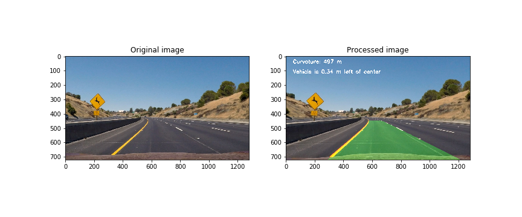

# lane_detection

Detect street lanes using computer vision.
The code is based on (but heavily updated) [Self Driving Car Engineer Nanodegree](https://github.com/udacity/CarND-Advanced-Lane-Lines).



### Demo

```python
from LaneDetection import LaneDetection
from tools.basic import cv2_imread
import matplotlib.pyplot as plt
import pickle
import numpy as np
import cv2

# Calibration values and perspective transformation parameters
calib = pickle.load(open("tools/calibration.p", "rb" )) # See Demo.py
src = np.float32([(526, 496), (762, 496), (1016, 664), (288, 664)])
dst = np.float32([(288,  464), (996,  464), (976,  664), (288,  664)])

# Load image and detect lane using LaneDetection
img = cv2_imread("assets/test2.jpg")
ld = LaneDetection(calib['mtx'], calib['dist'], src, dst)
img_res = ld.detect(img)

# Plot original next to processed image
fig, axes = plt.subplots(1,2, figsize=(12, 5))
axes[0].imshow(img)
axes[0].set_title("Original image")

axes[1].imshow(img_res)
axes[1].set_title("Processed image")
plt.savefig('original_and_processed.png')
```


